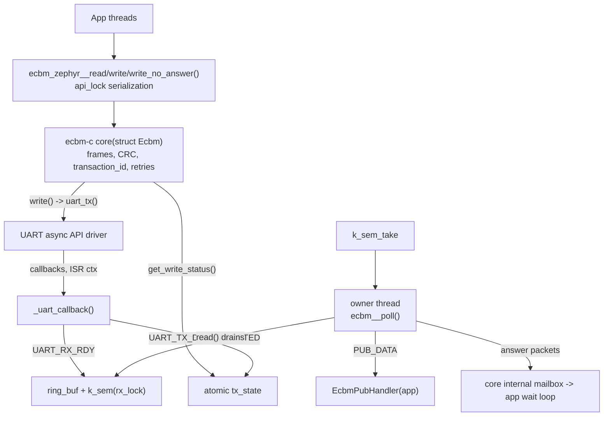

# ecbm-zephyr

Zephyr adaptation of the [ecbm-c](../ecbm-c) ECB master core: binds the core to
one UART(Zephyr async UART API), spawns the RX owner thread and exposes a
thread-safe master API. Any Zephyr project can use it by adding this directory
as a Zephyr module and pulling the ecbm-c sources into the app build.

## Architecture



### Context model(maps the ecbm-c contract to Zephyr)

| ecbm-c requirement | ecbm-zephyr implementation |
|---|---|
| single RX context calls `ecbm__poll()` | owner thread, created in `ecbm_zephyr__init()`, blocked on `k_sem` |
| transport RX drained by `poll()` | `read()` callback drains `ring_buf` filled by `UART_RX_RDY` ISR events |
| app calls serialized by the caller | `k_mutex api_lock` inside every wrapper, any thread may call |
| async write completion | `write()` -> `uart_tx()`, `get_write_status()` maps the atomic TX state set by `UART_TX_DONE`/`UART_TX_ABORTED` |
| monotonic ms time | `k_uptime_get_ms()` |
| sleep | `k_msleep()` |

The RX UART double buffer handling follows the async API contract:
`UART_RX_BUF_REQUEST` is answered with the free chunk(`uart_rx_buf_rsp`),
`UART_RX_BUF_RELEASED` returns it. Ring overflow drops bytes(warned): the frame
CRC fails on the slave side and the master retry covers the loss.

## Integration

1. Vendor `ecbm-c` and `ecbm-zephyr` next to each other, add to the app CMake
(sibling libs `safe-c`, `framer7b-c`, `byteorder-c`, `crc-c` are also required):

```cmake
list(APPEND EXTRA_ZEPHYR_MODULES <path>/ecbm-zephyr)
find_package(Zephyr REQUIRED HINTS $ENV{ZEPHYR_BASE})
add_subdirectory(<path>/ecbm-c)
```

2. Configure:

```
CONFIG_UART_ASYNC_API=y      # the driver must support the async API
CONFIG_ECBM_ZEPHYR=y
CONFIG_ECBM_MAX_PAYLOAD_SIZE=244
```

3. Use:

```c
#include <ecbm_zephyr.h>

static struct EcbmZephyr g_ecbm;

static void _on_pub(EcbmAddr addr, EcbmDataId data_id, uint8_t const* data, uint16_t data_size, void* user) {
    // owner thread context: fast, copy out, no ecbm API calls
}

struct EcbmZephyrConfig cfg = {
    .uart = DEVICE_DT_GET(DT_NODELABEL(uart1)),
    .uart_rx_timeout_us = 1000,
    .thread_name = "ecbm",
};
ecbm_zephyr__init(&g_ecbm, &cfg, _on_pub, NULL);

uint8_t buf[64];
uint16_t size = 0;
int rc = ecbm_zephyr__read(&g_ecbm, 0x10, 65281, buf, sizeof(buf), &size, 1000, 3);
```

## Notes and limits

- One instance per UART bus, any count of instances; the core transport
  callbacks receive the instance pointer as `transport_ctx`.
- Place instances in internal DMA-reachable RAM(on ESP32-S3 keep the default
  `.bss` placement, do not move `struct EcbmZephyr` to PSRAM): `uart_tx()` DMA
  reads the core `tx_buf` directly.
- `CONFIG_ECBM_ZEPHYR_TX_TIMEOUT_MS` must cover the whole frame at the bus
  baudrate(e.g. a 4096-byte payload at 9600 baud needs about 5 seconds).
- No deinit: instances live until reboot, as the protocol master usually does.
- `UART_RX_DISABLED` is only logged(error path of the UART driver), RX is not
  re-armed automatically.
